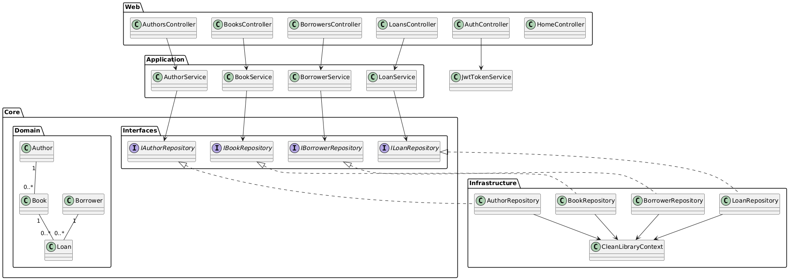

# Library Management System (Clean Architecture)  
**AUB EECE 437 – Assignment 4**  
---

## 1. Application Overview  
This project is a simple Library Management System built with ASP NET Core MVC (.NET 9), following Clean Architecture principles. It supports CRUD operations on Authors, Books, Borrowers, and Loans, and secures the UI/API with ASP NET Identity and JWT-based authentication.

---

## 2. Project Structure  
```
/Core.Domain
  ├── Entities
  │   ├── Author.cs
  │   ├── Book.cs
  │   ├── Borrower.cs
  │   └── Loan.cs
  ├── ValueObjects  (AuthorName, Title, Genre, BorrowerName)
  └── Interfaces    (IAuthorRepository, IBookRepository, IBorrowerRepository, ILoanRepository)

 /Application
  ├── Commands & Queries (CQRS via MediatR)
  ├── Handlers
  ├── Validators       (FluentValidation)
  ├── DTOs             (RegisterDto, LoginDto)
  └── MappingProfiles  (AutoMapper)

 /Infrastructure
  ├── Persistence
  │   └── CleanLibraryContext.cs   (EF Core DbContext + migrations)
  ├── Repositories                (implements domain interfaces)
  ├── Identity                    (ApplicationUser)
  ├── Services                    (JwtTokenService)
  └── Settings                    (JwtSettings)

 /Web (Presentation)
  ├── Controllers
  │   ├── AuthorsController
  │   ├── BooksController
  │   ├── BorrowersController
  │   ├── LoansController
  │   ├── AuthController          (Login/Register)
  │   └── HomeController
  ├── ViewModels
  ├── Views                      (Razor + Bootstrap)
  ├── wwwroot                    (Bootstrap via LibMan)
  └── Middleware                 (GlobalExceptionHandler)

 Program.cs  (DI, middleware, routing)
 appsettings.json  
```

---

## 3. How to Run Locally  

1. **Pre-reqs**  
   - [.NET 9 SDK](https://dotnet.microsoft.com/download)  
   - SQLite (no separate install needed if using the bundled provider)

2. **Clone & Configure**  
   ```bash
   git clone https://github.com/haifaashkar319/437-Lab4.git 
   cd 437-Lab4
   ```

3. **Connection & JWT Settings**  
   In `appsettings.json`:
   ```jsonc
   "ConnectionStrings": {
     "DefaultConnection": "Data Source=LibraryManagement.db"
   },
   "Jwt": {
     "Key":    "<your-32+-char secret>",
     "Issuer": "YourApp",
     "Audience": "YourAppUsers",
     "ExpiryMinutes": 60
   }
   ```

4. **Install EF Core Tools**  
   ```bash
   dotnet tool update --global dotnet-ef
   ```

5. **Add/Apply Migrations**  
   ```bash
   dotnet ef migrations add InitialIdentitySchema      --context CleanLibraryContext      --project Infrastructure      --startup-project Web

   dotnet ef database update      --context CleanLibraryContext      --project Infrastructure      --startup-project Web
   ```

6. **Seed Roles & DB**  
   Program.cs seeds “Admin” role and ensures legacy data context. No further manual step required.

7. **Run**  
   ```bash
   dotnet watch run
   ```
   Browse to: `http://localhost:5087/`

---

## 4. User Stories & Features  

| #  | As a…            | I want to…                                        | So that…                             |
|---:|------------------|---------------------------------------------------|--------------------------------------|
|  1 | Anonymous visitor| register / login                                  | I can access the management pages    |
|  2 | Admin            | view/add/edit/delete authors                      | manage the author catalog            |
|  3 | Admin            | view/add/edit/delete books                        | manage the book inventory            |
|  4 | Admin            | view/add/edit/delete borrowers                    | track who can borrow items           |
|  5 | Admin            | view/add/edit/delete loans                        | manage loan issuance & returns       |
|  6 | Admin            | see validation errors inline                      | I don’t submit invalid data          |
|  7 | Developer        | have code separated by layers                     | maintain & test each layer easily    |
|  8 | Developer        | use CQRS for reads/writes                         | clearly separate concerns            |
|  9 | Developer        | authenticate via JWT                              | support API security in future       |
| 10 | Developer        | have AutoMapper profiles                          | map between domain & view models     |

---

## 5. High-Level UML Class Diagram  


---

## 6. Key Design Decisions  
1. **Clean Architecture Layers** – clear separation: Core.Domain, Application, Infrastructure, Web.  
2. **CQRS & MediatR** – commands/queries keep read/write separate.  
3. **FluentValidation** – centralized, testable validators.  
4. **AutoMapper** – mapping profiles between DTOs/ViewModels and Entities.  
5. **Repository Pattern** – EF Core context & repositories decouple data access.  
6. **Identity + JWT** – ASP.NET Identity for user/role management and JWT for API security.  
7. **Bootstrap** – responsive, consistent UI styling via LibMan.

---

## 7. Setup & Deployment  
- **Environments**: swap SQLite for a production DB by changing connection strings for `Production`.  
---

**End of Report**  
